# mcp-oauth2-proxy

[](https://github.com/matheuscscp/mcp-oauth2-proxy/releases/latest)
[](https://github.com/matheuscscp/mcp-oauth2-proxy/actions/workflows/test.yml)
[](https://codecov.io/gh/matheuscscp/mcp-oauth2-proxy)
[](https://slsa.dev)


The search is over. Easy OAuth 2.0 proxy for MCP servers.

## Architecture

```mermaid
flowchart TB
    User[👤 User Browser<br/>Claude Web Page]
    AI[🤖 AI Client<br/>Claude Web Server]
    RP[🔀 Reverse Proxy<br/>e.g. nginx]
    Proxy[🛡️ mcp-oauth2-proxy<br/>Authorization Server]
    IdP[🔑 Identity Provider<br/>Google/GitHub/Microsoft]
    MCP1[📦 MCP Server 1<br/>host: server1.example.com]
    MCP2[📦 MCP Server 2<br/>host: server2.example.com]
    
    %% User interactions
    User -.-> AI
    User -.-> IdP
    User -.-> RP
    
    %% AI Client to services via Reverse Proxy
    AI --> RP
    RP --> Proxy
    RP --> MCP1
    RP --> MCP2
    
    %% Authentication flow
    Proxy -.-> IdP
    
    %% Styling
    classDef userStyle fill:#e1f5fe,stroke:#01579b,stroke-width:2px,color:#000
    classDef aiStyle fill:#f3e5f5,stroke:#4a148c,stroke-width:2px,color:#000
    classDef proxyStyle fill:#e8f5e8,stroke:#1b5e20,stroke-width:2px,color:#000
    classDef idpStyle fill:#fff3e0,stroke:#e65100,stroke-width:2px,color:#000
    classDef mcpStyle fill:#fce4ec,stroke:#880e4f,stroke-width:2px,color:#000
    classDef rpStyle fill:#f1f8e9,stroke:#33691e,stroke-width:2px,color:#000
    
    class User userStyle
    class AI aiStyle
    class Proxy proxyStyle
    class IdP idpStyle
    class MCP1,MCP2 mcpStyle
    class RP rpStyle
```



### How it Works

1. The user prompts the AI client to initiate the OAuth2 flow with mcp-oauth2-proxy
2. If the MCP server advertises scopes, mcp-oauth2-proxy presents the [consent screen](#permissions-consent-screen)
3. The mcp-oauth2-proxy redirects the user to the backing Identity Provider (IdP)
4. The user authenticates with the IdP
5. The IdP redirects back to mcp-oauth2-proxy with an authorization code
6. The mcp-oauth2-proxy exchanges the authorization code for the user info and performs validations
7. If validations pass, mcp-oauth2-proxy issues a JWT and redirects back to the AI client with another authorization code
8. The AI client exchanges the authorization code for the issued JWT
9. The AI client uses the JWT to access the MCP server

### API Endpoints

The mcp-oauth2-proxy exposes the following HTTP endpoints:

#### Authentication Endpoint
- **`/authenticate`** - Token validation endpoint used by reverse proxy
  - **Input Headers**:
    - `Authorization: Bearer <jwt-token>` - JWT issued by mcp-oauth2-proxy
  - **Output Headers** (on failure - HTTP 401):
    - `WWW-Authenticate: Bearer realm="mcp-oauth2-proxy", resource_metadata="<base-url>/.well-known/oauth-protected-resource"`

#### OAuth 2.0 Discovery Endpoints
- **`/.well-known/oauth-protected-resource`** - OAuth 2.0 Protected Resource metadata
- **`/.well-known/oauth-authorization-server`** - OAuth 2.0 Authorization Server metadata

#### OAuth 2.0 Flow Endpoints
- **`/register`** - OAuth 2.0 Dynamic Client Registration
- **`/authorize`** - OAuth 2.0 Authorization endpoint (PKCE required)
- **`/callback`** - OAuth 2.0 Authorization callback
- **`/token`** - OAuth 2.0 Token exchange endpoint

#### OpenID Connect (OIDC) Endpoints
- **`/.well-known/openid-configuration`** - OpenID Connect Discovery document
  - **Response**: JSON containing OIDC metadata including issuer, JWKS URI, and supported algorithms
  - **Fields**:
    - `issuer` - The authorization server's issuer identifier URL
    - `jwks_uri` - URL of the JSON Web Key Set containing signing keys
    - `id_token_signing_alg_values_supported` - Supported signing algorithms (RS256)
- **`/openid/v1/jwks`** - JSON Web Key Set (JWKS) for token verification
  - **Response**: JSON containing public keys used for JWT signature verification
  - **Fields**:
    - `keys` - Array of JWK objects containing RSA public keys for token verification

### Key Features

- **Dual OAuth2 Flows**: Creates an authorization realm where the AI client never knows about the backing IdP
- **Cryptographic Isolation**: Keeps IdP cryptographic material secure, away from both AI clients and MCP servers
- **Token Management**: Issues and manages its own JWTs for secure communication
- **Automatic Key Rotation**: Handles private key rotation for token signing and verification
- **Audit Logs**: Logs client registration, key generation and issued token claims
- **Host-based Identification**: Supports multiple MCP servers through HTTP Host header identification
- **Permissions Consent Screen**: If the MCP server advertises scopes, the user is presented with a consent screen

**Note:** The signing keys live only in memory and are rotated hourly.
To force an immediate key rotation, simply restart the proxy.
This will invalidate all existing tokens.

#### Permissions Consent Screen

MCP servers can advertise scopes through the `tools/list` MCP request. If the response
contains a `_meta.scopes` field with a list of scopes, the user will be presented
with a consent screen during the OAuth2 authorization flow to choose which scopes
should be granted to the issued token.

For example, if the MCP server responds with:

```json
[
  {
    "name": "toolbox:read_only",
    "description": "Allow all read-only toolbox operations.",
    "tools": [
      "get_resource",
      "list_resources"
    ]
  },
  {
    "name": "toolbox:read_write",
    "description": "Allow all toolbox operations.",
    "tools": [
      "get_resource",
      "list_resources",
      "create_resource",
      "update_resource",
      "delete_resource"
    ]
  },
  {
    "name": "toolbox:get_resource",
    "description": "Allow getting a resource.",
    "tools": [
      "get_resource"
    ]
  },
  {
    "name": "toolbox:list_resources",
    "description": "Allow listing resources.",
    "tools": [
      "list_resources"
    ]
  },
  {
    "name": "toolbox:create_resource",
    "description": "Allow creating resources.",
    "tools": [
      "create_resource"
    ]
  },
  {
    "name": "toolbox:update_resource",
    "description": "Allow updating resources.",
    "tools": [
      "update_resource"
    ]
  },
  {
    "name": "toolbox:delete_resource",
    "description": "Allow deleting resources.",
    "tools": [
      "delete_resource"
    ]
  }
]
```

Users will see a consent screen like this:


## Installation

### Container Image

A container image is distributed via GitHub Container Registry and signed with keyless Cosign:

```
ghcr.io/matheuscscp/mcp-oauth2-proxy
```

### Helm Chart

An OCI Helm chart is distributed via GitHub Container Registry and signed with keyless Cosign:

```bash
helm install mcp-oauth2-proxy oci://ghcr.io/matheuscscp/mcp-oauth2-proxy/charts/mcp-oauth2-proxy \
  --set provider.name=google \
  --set provider.clientID=your-client-id \
  --set provider.clientSecret=your-client-secret
```

The main configuration options are:

- `provider.name`: The identifier of the Identity Provider.
- `provider.clientID`: OAuth2 client ID from your IdP.
- `provider.clientSecret`: OAuth2 client secret from your IdP.
- `provider.allowedEmailDomains` (optional): List of Go regular expressions for allowed email domains.
- `proxy.hosts`: List of MCP server hosts to proxy requests for.
- `proxy.hosts[].host`: The HTTP Host header identifying the MCP server.
- `proxy.hosts[].endpoint`: The endpoint for the MCP server. Will be used for listing tools.
- `proxy.disableConsentScreen` (optional): Disable the permissions consent screen. Defaults to `false`.
- `proxy.allowedRedirectURLs` (optional): List of Go regular expressions for allowed redirect URLs.
- `proxy.cors` (optional): Enable CORS support. Defaults to `false`.
- `networkPolicy.create` (optional): Create a NetworkPolicy to restrict access to the proxy. Defaults to `true`.
- `ingress.enabled` (optional): Enable ingress for external access. Defaults to `false`.
- `podMonitor.enabled` (optional): Enable Prometheus monitoring. Defaults to `false`.

For all the available options, see [values.yaml](charts/mcp-oauth2-proxy/values.yaml).

#### Integration with ingress-nginx

To integrate with ingress-nginx, configure the mcp-oauth2-proxy Helm chart to enable ingress
by specifying a host configuration in the value `proxy.hosts`, then create Ingress resources
for each MCP server that requires authentication.

Example of Ingress resource for an MCP server:

```yaml
apiVersion: networking.k8s.io/v1
kind: Ingress
metadata:
  name: my-mcp-server
  annotations:
    cert-manager.io/cluster-issuer: letsencrypt-prod

    # Only the auth-url annotation is needed for mcp-oauth2-proxy
    nginx.ingress.kubernetes.io/auth-url: https://$host/authenticate
spec:
  ingressClassName: nginx
  tls:
    - hosts:
        - my-mcp.example.com
      secretName: my-mcp-server-tls
  rules:
    - host: my-mcp.example.com
      http:
        paths:
          - path: /mcp
            pathType: ImplementationSpecific
            backend:
              service:
                name: my-mcp-server
                port:
                  name: http
```

The key difference from traditional oauth2-proxy integration is that mcp-oauth2-proxy only requires the
`auth-url` annotation. The `/authenticate` endpoint handles token validation. If the token is not present
or is invalid, it returns 401 with the `WWW-Authenticate` header pointing to the authorization server
metadata endpoints, according to the MCP specification.

## Providers

- Google [Authentication](docs/google.md#authentication) (via Google Email)
- Google [Authorization](docs/google.md#authorization) (via Google Workspace Groups)
- GitHub [Authentication](docs/github.md#authentication) (via GitHub Username)
- GitHub [Authorization](docs/github.md#authorization) (via GitHub Organization Teams)

Don't see the provider you need? Just open an issue to let me know!
