# mcp-oauth2-proxy

[](https://github.com/matheuscscp/mcp-oauth2-proxy/releases/latest)
[](https://github.com/matheuscscp/mcp-oauth2-proxy/actions/workflows/test.yml)
[](https://slsa.dev)
[](https://codecov.io/gh/matheuscscp/mcp-oauth2-proxy)

The search is over. Easy OAuth 2.0 proxy for MCP servers.

## Architecture

```mermaid
flowchart TB
    User[👤 User Browser<br/>Claude Web Page]
    AI[🤖 AI Client<br/>Claude Web Server]
    RP[🔀 Reverse Proxy<br/>e.g. nginx]
    Proxy[🛡️ mcp-oauth2-proxy<br/>Authorization Server]
    IdP[🔑 Identity Provider<br/>Google/GitHub/Microsoft]
    MCP1[📦 MCP Server 1<br/>host: server1.example.com]
    MCP2[📦 MCP Server 2<br/>host: server2.example.com]
    
    %% User interactions
    User -.-> AI
    User -.-> IdP
    User -.-> RP
    
    %% AI Client to services via Reverse Proxy
    AI --> RP
    RP --> Proxy
    RP --> MCP1
    RP --> MCP2
    
    %% Authentication flow
    Proxy -.-> IdP
    
    %% Styling
    classDef userStyle fill:#e1f5fe,stroke:#01579b,stroke-width:2px,color:#000
    classDef aiStyle fill:#f3e5f5,stroke:#4a148c,stroke-width:2px,color:#000
    classDef proxyStyle fill:#e8f5e8,stroke:#1b5e20,stroke-width:2px,color:#000
    classDef idpStyle fill:#fff3e0,stroke:#e65100,stroke-width:2px,color:#000
    classDef mcpStyle fill:#fce4ec,stroke:#880e4f,stroke-width:2px,color:#000
    classDef rpStyle fill:#f1f8e9,stroke:#33691e,stroke-width:2px,color:#000
    
    class User userStyle
    class AI aiStyle
    class Proxy proxyStyle
    class IdP idpStyle
    class MCP1,MCP2 mcpStyle
    class RP rpStyle
```



### How it Works

1. **User Authentication**: The user authenticates with the Identity Provider (IdP) through their browser using OAuth2 + PKCE
2. **AI Client Authorization**: The AI client initiates its own OAuth2 + PKCE flow, treating mcp-oauth2-proxy as the authorization server
3. **Proxy Mediation**: mcp-oauth2-proxy handles the OAuth flow by redirecting the user to complete authentication with the backing IdP
4. **Token Issuance**: After successful IdP authentication, mcp-oauth2-proxy issues its own JWT token to the AI client
5. **MCP Access**: AI client uses the JWT token to access MCP servers through the reverse proxy
6. **Request Routing**: Reverse proxy routes requests to appropriate MCP servers based on the Host header
7. **Token Validation**: For each MCP request, the reverse proxy calls `/authenticate` to validate the bearer token
8. **MCP Server Access**: Reverse proxy forwards the request to the MCP server with the validated token

### API Endpoints

mcp-oauth2-proxy exposes the following HTTP endpoints:

#### Authentication Endpoint
- **`/authenticate`** - Token validation endpoint used by reverse proxy
  - **Input Headers**:
    - `Authorization: Bearer <jwt-token>` - JWT token issued by mcp-oauth2-proxy
  - **Output Headers** (on failure - HTTP 401):
    - `WWW-Authenticate: Bearer realm="mcp-oauth2-proxy", resource_metadata="<base-url>/.well-known/oauth-protected-resource"`

#### OAuth 2.0 Discovery Endpoints
- **`/.well-known/oauth-protected-resource`** - OAuth 2.0 Protected Resource metadata
- **`/.well-known/oauth-authorization-server`** - OAuth 2.0 Authorization Server metadata

#### OAuth 2.0 Flow Endpoints
- **`/register`** - OAuth 2.0 Dynamic Client Registration
- **`/authorize`** - OAuth 2.0 Authorization endpoint (PKCE required)
- **`/callback`** - OAuth 2.0 Authorization callback
- **`/token`** - OAuth 2.0 Token exchange endpoint

#### OpenID Connect (OIDC) Endpoints
- **`/.well-known/openid-configuration`** - OpenID Connect Discovery document
  - **Response**: JSON containing OIDC metadata including issuer, JWKS URI, and supported algorithms
  - **Fields**:
    - `issuer` - The authorization server's issuer identifier URL
    - `jwks_uri` - URL of the JSON Web Key Set containing signing keys
    - `id_token_signing_alg_values_supported` - Supported signing algorithms (RS256)
- **`/openid/v1/jwks`** - JSON Web Key Set (JWKS) for token verification
  - **Response**: JSON containing public keys used for JWT token signature verification
  - **Fields**:
    - `keys` - Array of JWK objects containing RSA public keys for token verification

### Key Features

- **Dual OAuth2 Flows**: Creates an authorization realm where the AI client never knows about the backing IdP
- **Cryptographic Isolation**: Keeps IdP cryptographic material secure, away from both AI clients and MCP servers
- **JWT Token Management**: Issues and manages its own JWT tokens for secure communication
- **Automatic Key Rotation**: Handles private key rotation for token signing and verification
- **Host-based Routing**: Supports multiple MCP servers through HTTP Host header routing

## Installation

### Container Image

A container image is distributed via GitHub Container Registry and signed with keyless Cosign:

```
ghcr.io/matheuscscp/mcp-oauth2-proxy
```

### Helm Chart

An OCI Helm chart is distributed via GitHub Container Registry and signed with keyless Cosign:

```bash
helm install mcp-oauth2-proxy oci://ghcr.io/matheuscscp/mcp-oauth2-proxy/charts/mcp-oauth2-proxy \
  --set provider.name=google \
  --set provider.clientID=your-client-id \
  --set provider.clientSecret=your-client-secret
```

**Note**: The provider defaults to Google if not specified in the Helm values.

For all available configuration options, see the [values.yaml](charts/mcp-oauth2-proxy/values.yaml) file.

### ingress-nginx Integration

To integrate with ingress-nginx, configure the mcp-oauth2-proxy Helm chart to enable ingress, then create Ingress resources for each MCP server that requires authentication.

#### Configure mcp-oauth2-proxy Ingress via Helm

```bash
helm install mcp-oauth2-proxy oci://ghcr.io/matheuscscp/mcp-oauth2-proxy/charts/mcp-oauth2-proxy \
  --set provider.clientID=your-client-id \
  --set provider.clientSecret=your-client-secret \
  --set ingress.enabled=true \
  --set ingress.className=nginx \
  --set 'ingress.hosts[0]=my-mcp.example.com'
```

#### MCP Server Ingress

```yaml
apiVersion: networking.k8s.io/v1
kind: Ingress
metadata:
  name: my-mcp-server
  annotations:
    cert-manager.io/cluster-issuer: letsencrypt-prod
    # Only the auth-url annotation is needed for mcp-oauth2-proxy integration
    nginx.ingress.kubernetes.io/auth-url: https://$host/authenticate
spec:
  ingressClassName: nginx
  tls:
    - hosts:
        - my-mcp.example.com
      secretName: my-mcp-server-tls
  rules:
    - host: my-mcp.example.com
      http:
        paths:
          - path: /mcp
            pathType: ImplementationSpecific
            backend:
              service:
                name: my-mcp-server
                port:
                  name: http
```

The key difference from traditional oauth2-proxy integration is that mcp-oauth2-proxy only requires the
`auth-url` annotation. The `/authenticate` endpoint handles token validation. If the token is not present
or is invalid, it returns 401 with the `WWW-Authenticate` header.

### Key Configuration Options

- `provider.name`: OAuth2 provider. One of [`google`, `github`]. Defaults to `google`.
- `provider.clientID`: OAuth2 client ID from your IdP.
- `provider.clientSecret`: OAuth2 client secret from your IdP.
- `provider.allowedEmailDomains` (optional): List of Go regular expressions for allowed email domains.
- `proxy.allowedRedirectURLs` (optional): List of Go regular expressions for allowed redirect URLs.
- `proxy.hosts`: List of MCP server hosts.
- `proxy.hosts[].host`: The HTTP Host header identifying the MCP server.
- `proxy.hosts[].scopes` (optional): List of scopes for the MCP server (optional).
- `proxy.hosts[].scopes[].name`: Name of the scope.
- `proxy.hosts[].scopes[].description`: Description of the scope.
- `proxy.hosts[].scopes[].covers` (optional): List of scopes this scope already covers.
- `server.cors` (optional): Enable CORS support. One of `true` or `false`. Defaults to `false`.
- `ingress.enabled` (optional): Enable ingress for external access. One of `true` or `false`. Defaults to `false`.
- `podMonitor.enabled` (optional): Enable Prometheus monitoring. One of `true` or `false`. Defaults to `false`.

## Roadmap

- [x] Google Authentication
- [x] GitHub Authentication
- [ ] Microsoft Entra ID Authentication
- [ ] Google Authorization (via Google Groups)
- [ ] GitHub Authorization (via GitHub Teams)
- [ ] Microsoft Entra ID Authorization (via Microsoft Entra ID Groups)
