# mcp-oauth2-proxy

[](https://github.com/matheuscscp/mcp-oauth2-proxy/releases/latest)
[](https://github.com/matheuscscp/mcp-oauth2-proxy/actions/workflows/test.yml)
[](https://slsa.dev)
[](https://codecov.io/gh/matheuscscp/mcp-oauth2-proxy)

The search is over. Easy OAuth 2.0 proxy for MCP servers.

## Architecture

```mermaid
flowchart TB
    User[👤 User<br/>Browser]
    AI[🤖 AI Client<br/>Claude Desktop]
    RP[🔀 Reverse Proxy<br/>nginx]
    Proxy[🛡️ mcp-oauth2-proxy<br/>Authorization Server]
    IdP[🔑 Identity Provider<br/>Google/GitHub/Azure]
    MCP1[📦 MCP Server 1<br/>host: server1.example.com]
    MCP2[📦 MCP Server 2<br/>host: server2.example.com]
    
    %% User OAuth Flow with IdP
    User -.->|"1. Browser OAuth2+PKCE<br/>Authorization Code Flow"| IdP
    IdP -.->|"User Authentication"| User
    
    %% AI Client OAuth Flow with Proxy
    AI -->|"2. OAuth2+PKCE Flow<br/>Authorization Code"| RP
    RP -->|"Routes OAuth paths:<br/>/authenticate, /.well-known/*<br/>/register, /authorize<br/>/callback, /token"| Proxy
    
    %% Proxy acts as Authorization Server
    Proxy -.->|"3. Redirect to browser<br/>for user consent"| User
    User -.->|"4. User completes<br/>OAuth with IdP"| Proxy
    Proxy -.->|"5. Issues JWT token<br/>to AI Client"| AI
    
    %% MCP Server Access
    AI -->|"6. Bearer JWT token"| RP
    RP -->|"Routes by Host header<br/>to appropriate MCP server"| MCP1
    RP -->|"Routes by Host header<br/>to appropriate MCP server"| MCP2
    
    %% Authentication Check
    RP -->|"7. /authenticate<br/>Bearer token validation"| Proxy
    Proxy -->|"8. X-Auth-Request-Access-Token<br/>if valid (200) or<br/>WWW-Authenticate if invalid (401)"| RP
    RP -->|"9. Forward request with<br/>validated token or<br/>return 401 to AI Client"| MCP1
    RP -->|"9. Forward request with<br/>validated token or<br/>return 401 to AI Client"| MCP2
    
    %% Backend IdP Communication
    Proxy -.->|"OAuth2 token exchange<br/>User verification"| IdP
    
    %% Styling
    classDef userStyle fill:#e1f5fe,stroke:#0277bd,stroke-width:2px
    classDef aiStyle fill:#f3e5f5,stroke:#7b1fa2,stroke-width:2px
    classDef proxyStyle fill:#e8f5e8,stroke:#2e7d32,stroke-width:2px
    classDef idpStyle fill:#fff3e0,stroke:#ef6c00,stroke-width:2px
    classDef mcpStyle fill:#fce4ec,stroke:#c2185b,stroke-width:2px
    classDef rpStyle fill:#f1f8e9,stroke:#558b2f,stroke-width:2px
    
    class User userStyle
    class AI aiStyle
    class Proxy proxyStyle
    class IdP idpStyle
    class MCP1,MCP2 mcpStyle
    class RP rpStyle
```



### How it Works

1. **User Authentication**: The user authenticates with the Identity Provider (IdP) through their browser using OAuth2 + PKCE
2. **AI Client Authorization**: The AI client initiates its own OAuth2 + PKCE flow, treating mcp-oauth2-proxy as the authorization server
3. **Proxy Mediation**: mcp-oauth2-proxy handles the OAuth flow by redirecting the user to complete authentication with the backing IdP
4. **Token Issuance**: After successful IdP authentication, mcp-oauth2-proxy issues its own JWT token to the AI client
5. **MCP Access**: AI client uses the JWT token to access MCP servers through the reverse proxy
6. **Request Routing**: Reverse proxy routes requests to appropriate MCP servers based on the Host header
7. **Token Validation**: For each MCP request, the reverse proxy calls `/authenticate` to validate the bearer token
8. **Secure Token Passing**: mcp-oauth2-proxy validates the token and returns it via `X-Auth-Request-Access-Token` header if valid
9. **MCP Server Access**: Reverse proxy forwards the request to the MCP server with the validated token

### Key Features

- **Dual OAuth2 Flows**: Creates an authorization realm where the AI client never knows about the backing IdP
- **Cryptographic Isolation**: Keeps IdP cryptographic material secure, away from both AI clients and MCP servers
- **JWT Token Management**: Issues and manages its own JWT tokens for secure communication
- **Automatic Key Rotation**: Handles private key rotation for token signing and verification
- **Host-based Routing**: Supports multiple MCP servers through HTTP Host header routing

## Installation

### Container Images

Container images are distributed via GitHub Container Registry and signed with keyless Cosign:

```
ghcr.io/matheuscscp/mcp-oauth2-proxy
```

### Helm Chart

OCI Helm charts are available in GitHub Container Registry and signed with keyless Cosign:

```bash
helm install mcp-oauth2-proxy oci://ghcr.io/matheuscscp/mcp-oauth2-proxy/charts/mcp-oauth2-proxy \
  --set provider.name=google \
  --set provider.clientID=your-client-id \
  --set provider.clientSecret=your-client-secret
```

**Note**: The provider defaults to Google if not specified in the Helm values.

For all available configuration options, see the [values.yaml](charts/mcp-oauth2-proxy/values.yaml) file.

### ingress-nginx Integration

To integrate with ingress-nginx, configure the mcp-oauth2-proxy Helm chart to enable ingress, then create Ingress resources for each MCP server that requires authentication.

#### Configure mcp-oauth2-proxy Ingress via Helm

```bash
helm install mcp-oauth2-proxy oci://ghcr.io/matheuscscp/mcp-oauth2-proxy/charts/mcp-oauth2-proxy \
  --set provider.clientID=your-client-id \
  --set provider.clientSecret=your-client-secret \
  --set ingress.enabled=true \
  --set ingress.className=nginx \
  --set 'ingress.hosts[0]=auth.example.com'
```

#### MCP Server Ingress

```yaml
apiVersion: networking.k8s.io/v1
kind: Ingress
metadata:
  name: my-mcp-server
  annotations:
    cert-manager.io/cluster-issuer: letsencrypt-prod
    # Only the auth-url annotation is needed for mcp-oauth2-proxy integration
    nginx.ingress.kubernetes.io/auth-url: https://my-mcp.example.com/authenticate
spec:
  ingressClassName: nginx
  tls:
    - hosts:
        - my-mcp.example.com
      secretName: my-mcp-server-tls
  rules:
    - host: my-mcp.example.com
      http:
        paths:
          - path: /mcp
            pathType: ImplementationSpecific
            backend:
              service:
                name: my-mcp-server
                port:
                  name: http
```

The key difference from traditional oauth2-proxy integration is that mcp-oauth2-proxy only requires the `auth-url` annotation. The `/authenticate` endpoint handles token validation and returns the validated token via the `X-Auth-Request-Access-Token` header when authentication succeeds, or returns 401 with `WWW-Authenticate` header when authentication fails.

### Key Configuration Options

- `provider.name`: OAuth2 provider (`google`)
- `provider.clientID`: OAuth2 client ID from your IdP
- `provider.clientSecret`: OAuth2 client secret from your IdP  
- `provider.allowedEmailDomains`: List of Go regular expressions for allowed email domains
- `proxy.allowedRedirectURLs`: List of Go regular expressions for allowed redirect URLs
- `server.cors`: Enable CORS support
- `ingress.enabled`: Enable ingress for external access
- `podMonitor.enabled`: Enable Prometheus monitoring

## Roadmap

- [x] Google Authentication
- [ ] GitHub Authentication
- [ ] Microsoft Entra ID Authentication
- [ ] Google Authorization (via Google Groups)
- [ ] GitHub Authorization (via GitHub Teams)
- [ ] Azure Authorization (via Microsoft Entra ID Groups)
